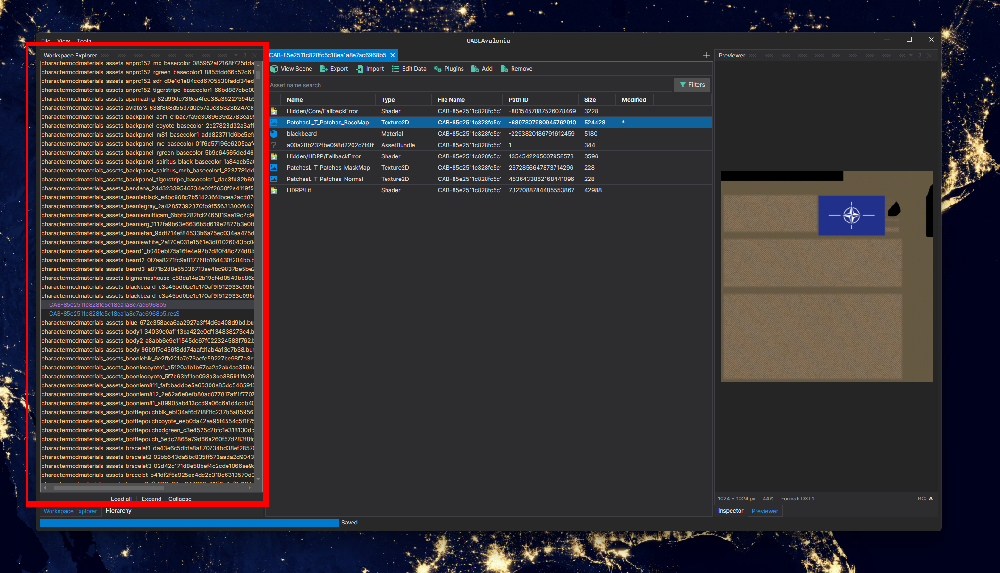
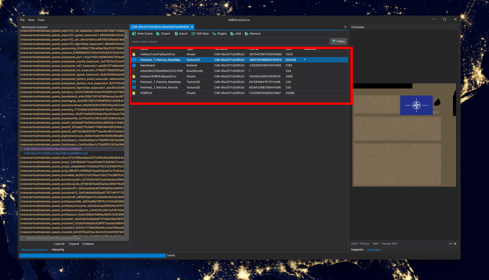
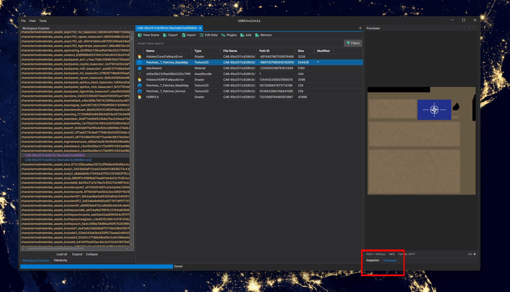
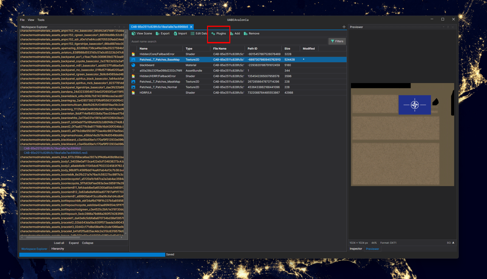
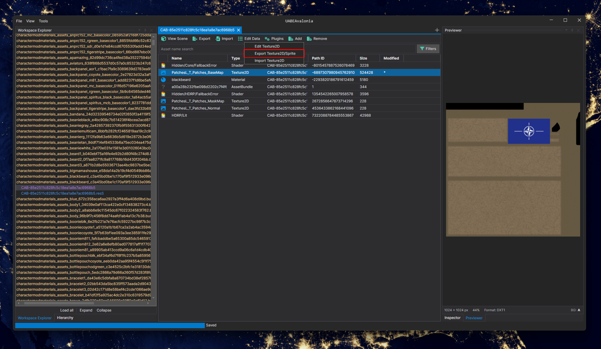

Download the .zip from the nightly link for the OS you're using. you can complie from source if you went but I'm lazy and trust the software enough, so I just download from the nightly.

Open UABEANext</a> and open folders by using files -> open folder or ctrl + shift + o

Locate your OPERATOR folder: right-click OPERATOR, and then manage -> Browse local files.

All the files should be in OPERATOR_Data -> StreamingAssets-> aa -> StandaloneWindows64. (it will probably take sometime to load)

Find the .bundle/assset where the texture you want to replace is at(red)

Now find the file(s) you want to replace (red) you can use the filter to find what you need if theres a lot

You can use the "preview" button (red) to see if you've got the right one

Now once you've got it, click plugin (red +you don't need any "plugins" that you need to download, that's just what it's called)

Click export and edit it

lastly click plugins and import, and select the folder where your edited texture is located, and this dialog box will popup and show a list of the 2DTextures, find the one you edited and click OK

To now save it to actually use it, go to files -> Save Selected As or ctrl + shift + s

⚠️I'm not responsible for any risk that may come with doing this. please be aware of any potential risks.⚠️
